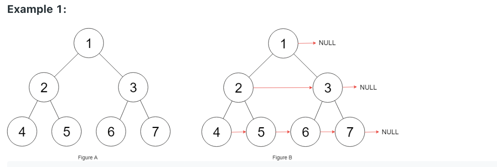

# 116 각 노드의 다음 오른쪽 포인터 채우기 !

    - 완전 이진트리가 제공 되어진다.(자식 노드가 전부 채워진 트리)
    - 트리 의 각 노드는 아래 와 같은 정의를 가진다.

- 제한사항
  - 트리안의 노드의 갯수는 0 ~ 2^12-1
  - -1000<= 노드 의 벨류 <= 1000
    [🚀 릿코드 바로가기](https://leetcode.com/problems/populating-next-right-pointers-in-each-node/)

```java
struct Node {
  int val;
  Node *left;
  Node *right;
  Node *next;
}
```

예시


```
Example 1:

- Input: root = [1,2,3,4,5,6,7]
- Output = [1,#,2,3,#,4,5,6,7,#]
  - 위에 보이는 거와 같이 각 노드 의 오른쪽 노드를 등록해준다.
  - 오른쪽이 비어 있다면 null 로 표시한다.
    - 1,3,7 노드 오른쪽 포인터는 null 이다.
    - "#" 은 노드 레벨에서의 끝을 의미한다.
```

```
Example 2:

- Input: root = []
- outPut []

- 노드가 비어 있더라도 위와같이 노드를 반환해서 출력 해주어야 한다.
```

- 요구사항

  - 일정한 추가 공간만을 사용할수 있다.
  - 스택을 구현한 공간은 추가 공간으로 취급되지 않아, 재귀적 접근 또한 가능하다.

- 관련주제

  - LinkedList, Tree, Dfs,Bfs,BinaryTree

- 작성은 IDE 에서 하시고 코드 통과 여부는 릿코드에 가셔서 하시는걸 추천드립니다.
- [🚀 릿코드 바로가기](https://leetcode.com/problems/populating-next-right-pointers-in-each-node/)

```java
// Test 노드 는 아래 복사붙여넣기하셔서 사용하시면 됩니다.
Node ex1 = new Node(1,new Node(2,new Node(4),new Node(5),null),new Node(3,new Node(6),new Node(7),null),null);

Node ex2 = new Node();
```

- 아래와 Solution class 안의 connet 함수 작성;
- 작성은 IDE 에서 하시고 코드 통과 여부는 릿코드에 가셔서 하시는걸 추천드립니다.
  [🚀 릿코드 바로가기](https://leetcode.com/problems/populating-next-right-pointers-in-each-node/)

```java
/*
// Definition for a Node.
class Node {
    public int val;
    public Node left;
    public Node right;
    public Node next;

    public Node() {}

    public Node(int _val) {
        val = _val;
    }

    public Node(int _val, Node _left, Node _right, Node _next) {
        val = _val;
        left = _left;
        right = _right;
        next = _next;
    }
};
*/
class Solution{
    public Node connect(Node root) {
    }
}

```
