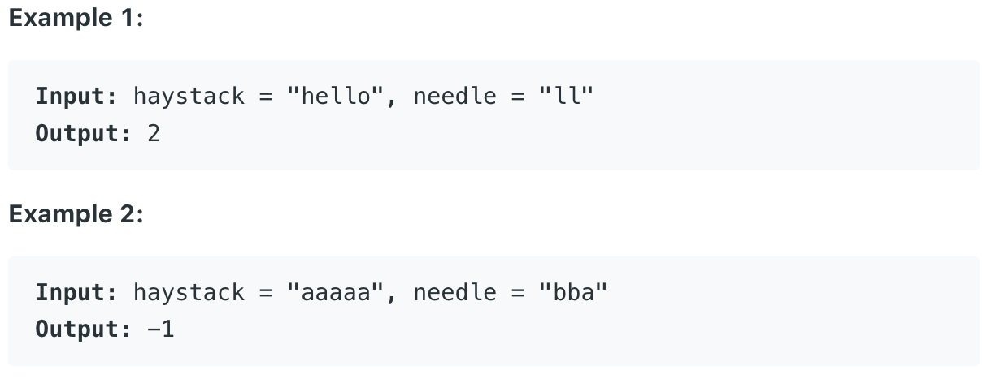
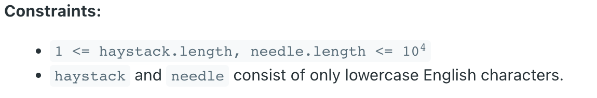

# 28. strStr() 을 구현해 주세요.[난이도 쉬움]

    - 2개 의 String 이 주어집니다.(needle, hayStack)
    - needle 이 haystack 의 한부분을 차지한다면 시작 인덱스를 반환해주세요.
    - 만약 needle 이 haystack 의 일부분이 아니라면 -1 을 리턴해주세요.

- [풀러가기🚀](https://leetcode.com/problems/implement-strstr/)

- 명확한 설명
  - 만약 needle 이 비어있는 문자라면 무엇을 반환해야 할까요 ? 이것은 인터뷰중 훌륭한 질문이 될수 있습니다.
  - 우리의 문제의 목제이 따르자면, 우리는 0 을 반환 해야 합니다.
  - C 언어의 strstr() 또는 Java 의 indexOf 와 일치 합니다.

### 예시

### 제한사항

- haystack, needle 은 모두 영어 소문자 입니다. !

- [풀러가기🚀](https://leetcode.com/problems/implement-strstr/)

#### 관련주제

    - Two Pointers, String, String Matching

#### 정답율

    - 36.6%
