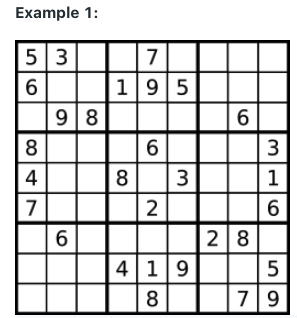
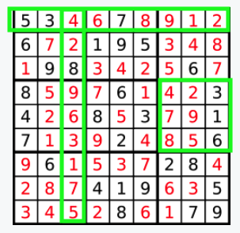
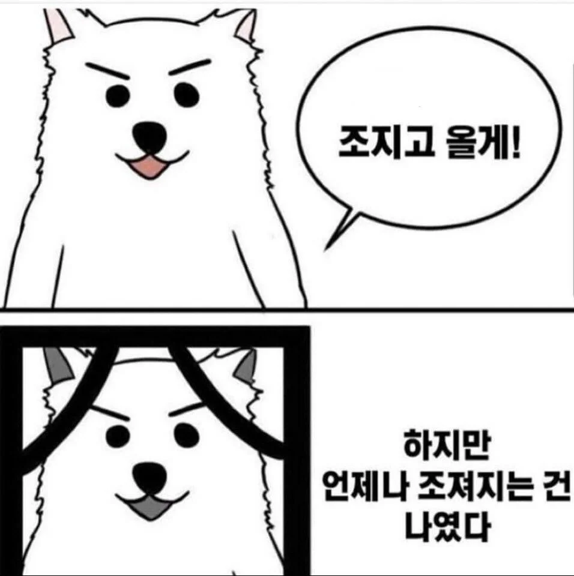

# 🎉 깜작문제 풀었던 문제 도 다시한번 돌아온 "스도쿠" 🎉

    - 스도쿠 의 비어있는 셀을 체우는 정답 프로그래밍을 작성하라.
    (지난번 은 스도쿠 가 성립 가능한지 에 대한 여부판단 이였음)
    - 이번에는 업그레이드 !! 숫자를 채워주세요

## 문제

    - board 형태의 2차원 char 배열이 주어진다.
    - 비어있는 셀의 경우 '.' 이러한 형식으로 주어지고, 비어있지 않다면 숫자 형태의 char 값이 주어진다.

- [풀러가기](https://leetcode.com/problems/sudoku-solver/)

### 제한사항

    - 게임 판의 가로 세로 는 9*9 규격으로 동일하다.
    - board[i][j] 는 숫자 or '.' 으로만 구성된다.
    - 주어진 인풋 스도쿠는 오직 한가지 답만 가지고 있다.

### 스토쿠 의 룰

    - 각각의 열 에는 1~9 까지 모든 숫자가 반드시 한번 들어가야 한다.
    - 각각의 행 에는 1~9 까지 모든 숫자가 반드시 한번 들어가야 한다.
    - 3*3 서브박스의 형태 에는 모든 1~9 가 반드시 한번 들어가야 한다.

- [풀러가기](https://leetcode.com/problems/sudoku-solver/)
  

- input 은 아래와 같이 주어진다.

  - Input: board = [["5","3",".",".","7",".",".",".","."] ••• 중략 ,[".",".",".",".","8",".",".","7","9"]];

- Output 은 input 의 비어있는 셀을 채워주면된다.

| 1 | 2 | 3 |
| --- | --- | --- |
| 4 | 5 | 6 |
| 7 | 8 | 9 |

### 추가설명

    - 각각의 1 ~ 9 번 까지는 모두 3\*3 형태의 서브박스로 나눈 모양이다
    - 3*3 연두색 박스 는 현재 6번을 가르킨다, 다시 말하면, 3*3 연두색 박스 모양으로 1 ~9 번까지도 모두 만족해야 한다.

    - 연두색 박스 는 행,열 구분없이 3*3 은 위에 주어진 표 모든 곳을 만족해야 한다.

- [풀러가기](https://leetcode.com/problems/sudoku-solver/)

### 저도 다시 풀어보니 어렵네요

